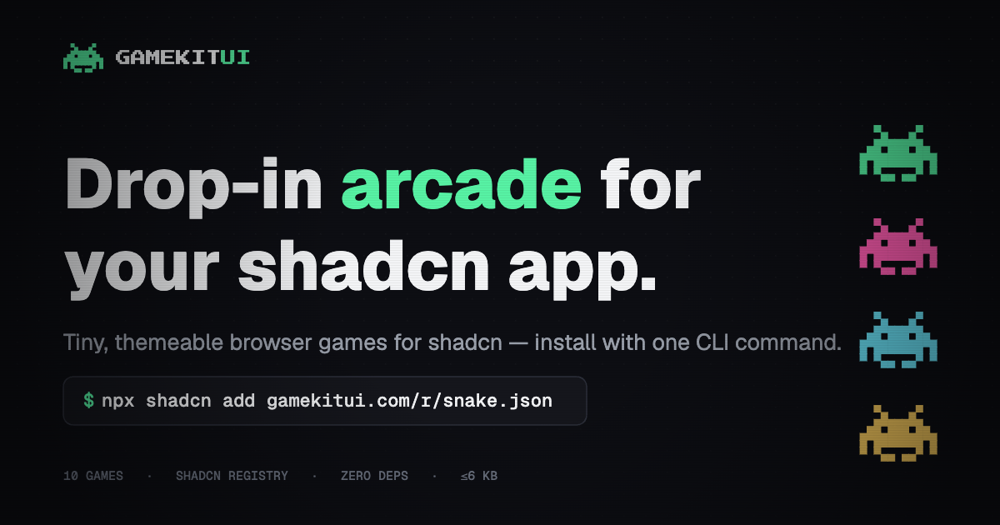

<div align="center">

<a href="https://gamekitui.com">
  
</a>

<h1>GameKit UI</h1>

<p><strong>Drop-in browser games for shadcn.</strong><br/>
Minimal, themeable React/TSX games installable with the shadcn CLI — perfect for 404 pages, empty states, loading screens, and landing-page easter eggs.</p>

<p>
  <a href="https://github.com/slarity/gamekit-ui/blob/main/LICENSE"></a>
  <a href="https://github.com/slarity/gamekit-ui/stargazers"></a>
  
  
  
  <a href="https://github.com/slarity/gamekit-ui/blob/main/CONTRIBUTING.md"></a>
</p>

<p>
  <a href="https://gamekitui.com"><b>Website</b></a> ·
  <a href="https://gamekitui.com/games"><b>Games</b></a> ·
  <a href="https://gamekitui.com/docs"><b>Docs</b></a> ·
  <a href="https://github.com/slarity/gamekit-ui/blob/main/CONTRIBUTING.md"><b>Contributing</b></a> ·
  <a href="https://github.com/slarity/gamekit-ui/issues/new"><b>Report a bug</b></a>
</p>

</div>

---

```bash
npx shadcn@latest add https://gamekitui.com/r/snake.json
```

No provider. No peer deps. No init step. Each game is a single drop-in file that **inherits your shadcn theme** automatically — light/dark and any preset. Drop one on a 404 and it plays on the first keypress.

## ✨ Highlights

- **🪶 Minimal** — each game is a single file with zero npm dependencies beyond `react` and your existing `cn` helper. **2–4&nbsp;KB minified + gzipped** (the raw `.tsx` is bigger because it inlines its engine and theme hooks), and lazy-loadable so it never weighs down your initial bundle.
- **🎨 Themeable** — your `--primary` / `--secondary` / `--accent` drive the *playfield*, not just the chrome. Canvas games read the tokens at runtime; DOM games use Tailwind token classes. Change your theme and the games recolor live.
- **🚫 Zero assets** — no images, audio, or fonts. Every pixel is drawn with CSS or `<canvas>`.
- **♿ Accessible** — keyboard + touch input, visible focus rings, `aria-live` announcements, and `prefers-reduced-motion` support in every game.

## 🕹️ The lineup

| Game | Surface | Install |
|---|---|---|
| 🐍 Snake | canvas | `npx shadcn@latest add https://gamekitui.com/r/snake.json` |
| ⭕ Tic-Tac-Toe | DOM | `npx shadcn@latest add https://gamekitui.com/r/tic-tac-toe.json` |
| 🔢 2048 | DOM | `npx shadcn@latest add https://gamekitui.com/r/2048.json` |
| 🃏 Memory Match | DOM | `npx shadcn@latest add https://gamekitui.com/r/memory-match.json` |
| 🔨 Whack-a-Mole | DOM | `npx shadcn@latest add https://gamekitui.com/r/whack-a-mole.json` |
| 💣 Minesweeper | DOM | `npx shadcn@latest add https://gamekitui.com/r/minesweeper.json` |
| 🏓 Pong | canvas | `npx shadcn@latest add https://gamekitui.com/r/pong.json` |
| 🧱 Breakout | canvas | `npx shadcn@latest add https://gamekitui.com/r/breakout.json` |
| 🦖 Dino Runner | canvas | `npx shadcn@latest add https://gamekitui.com/r/dino-runner.json` |
| 🐦 Flappy | canvas | `npx shadcn@latest add https://gamekitui.com/r/flappy.json` |

> Base registry URL: `https://gamekitui.com/r/{name}.json`

## 🚀 Usage

```tsx
// app/not-found.tsx
import { Snake } from "@/components/games/snake";

export default function NotFound() {
  return (
    <main className="grid min-h-svh place-items-center">
      <div className="space-y-4 text-center">
        <h1 className="text-4xl font-semibold">404</h1>
        <p className="text-muted-foreground">Play a round while you decide where to go.</p>
        <Snake className="mx-auto rounded-lg border" width={320} />
      </div>
    </main>
  );
}
```

That's it — no setup. On a single-game page like this, the game captures keyboard input globally, so it responds the moment a visitor presses a key (no click-to-focus needed).

### Bundle size & lazy-loading

The installed `.tsx` looks big (~15–28 KB) because it inlines its own engine and theme hooks to stay a true single-file drop-in — but that's **source**, not what ships. Built for production each game is **2–4 KB minified + gzipped**.

Because every game is a self-contained module, it's trivially code-split — lazy-load it so it never touches your initial bundle and only downloads when the easter egg actually renders:

```tsx
import dynamic from "next/dynamic";

const Snake = dynamic(() => import("@/components/games/snake").then((m) => m.Snake), {
  ssr: false,
  loading: () => <div className="aspect-square w-full animate-pulse rounded-lg bg-muted" />,
});
```

### Namespace install (optional)

Register the `@gamekit` namespace in your `components.json`:

```jsonc
{
  "registries": {
    "@gamekit": "https://gamekitui.com/r/{name}.json"
  }
}
```

```bash
npx shadcn@latest add @gamekit/snake
```

## ⚙️ Shared props

Every game accepts a common subset of props:

| Prop | Type | Description |
|---|---|---|
| `className` | `string` | Tailwind classes on the wrapper. |
| `width` / `height` | `number` | Logical size in CSS px (canvas games scale via DPR). |
| `paused` | `boolean` | Externally pause the game. |
| `autoFocus` | `boolean` | Focus on mount. Defaults to `true`. |
| `captureGlobalKeys` | `boolean` | Listen for keys on `window` so the game works without being focused first. Defaults to `true` — set `false` when several games share a page, or the game sits in scrollable content, so it only responds while focused. |
| `persistHighScore` | `boolean \| string` | localStorage key, or a default per game. |
| `onScoreChange` | `(score: number) => void` | Fires when the score changes. |
| `onGameOver` | `(r: { score: number; won: boolean }) => void` | Fires on game over. |

## 🗂️ Repository layout

```
apps/web                  Next.js 16 marketing + docs site; serves /r/*.json
packages/registry         The game sources (one self-contained file each)
packages/game-core        Shared contract types + reference hooks (zero runtime)
packages/ui               shadcn primitives used by the site
scripts/build-registry.ts Emits apps/web/public/r/*.json from the game sources
```

## 🛠️ Development

```bash
bun install
bun run dev            # builds the registry, then starts the site on :3001
```

Other scripts:

```bash
bun run build          # registry build + next build
bun run check-types    # typecheck every workspace
cd packages/registry && bun smoke.tsx   # render smoke test for every game
```

## 🤝 Contributing

Contributions are welcome! See [CONTRIBUTING.md](./CONTRIBUTING.md) for the "add a new game" guide — the engine/wrapper template, the shared props contract, the theme-token mapping, and the size budget. Please also review our [Code of Conduct](./CODE_OF_CONDUCT.md).

Found a bug or have an idea? [Open an issue](https://github.com/slarity/gamekit-ui/issues/new).

## ⚠️ Disclaimer

**GameKit UI** is an independent, unaffiliated community project. It is not built, sponsored, or endorsed by the shadcn/ui team. It uses the shadcn registry system. The `shadcn-` prefix is reserved for official projects, which is why this project is named `gamekitui` (not `shadcn-games`).

## 📄 License

[MIT](./LICENSE) © GameKit UI contributors

<div align="center">
<sub>Built with ❤️ for the shadcn community.</sub>
</div>
